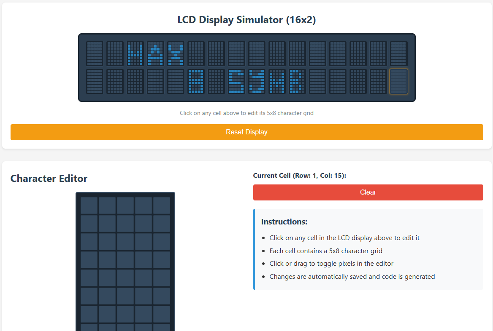
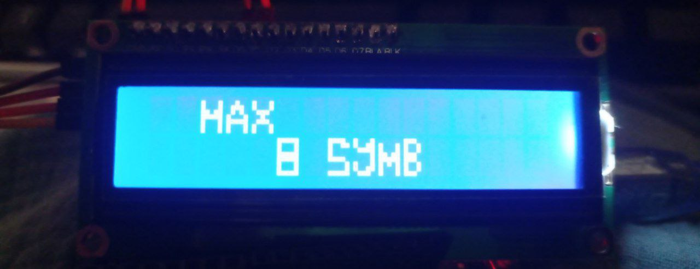

# LCD Character Creator for Arduino

**Author:** INDUREVOL

## Description

A web-based tool for creating custom characters for 16x2 LCD displays used with Arduino projects. This tool provides a visual interface where you can design custom characters on a 5x8 pixel grid and generate the corresponding Arduino code.

## ⚠️ IMPORTANT WARNING ⚠️

**LCD displays support a maximum of 8 custom characters.** While this tool will generate code for all unique characters you create, only the first 8 characters will actually work on real hardware. This is a hardware limitation of LCD displays, not a limitation of this software.

## Features

- 16x2 LCD display simulator with clickable cells
- 5x8 pixel grid editor for each character cell
- Real-time code generation (no manual saving required)
- Support for both I2C and basic (parallel) LCD connections
- Choice between hexadecimal and binary code formats
- Automatic optimization of character usage (detects and reuses duplicate characters)
- One-click code copying to clipboard
- No artificial limits on number of characters in generated code (but hardware limited to 8)

## Screenshots

## How to Use

1. Simply copy the project files to your computer
2. Open `index.html` in any modern web browser
3. Click on any cell in the 16x2 display to select it for editing
4. Use the 5x8 grid editor to create your custom character:
   - Click or drag to toggle pixels on/off
   - Changes are automatically saved and code is generated in real-time
5. Switch between I2C and basic transmission modes as needed
6. Choose between hexadecimal or binary code format
7. Click "Copy Code" to copy the generated Arduino code to your clipboard
8. Paste the code into your Arduino IDE project

## Arduino Code Features

The generated code includes:
- Proper LCD initialization for both I2C and basic connections
- Efficient character creation using `lcd.createChar()`
- Automatic detection and optimization of duplicate characters
- Use of `lcd.setCursor()` and `lcd.write()` for precise character placement

## GitHub Repository

[https://github.com/indurevol](https://github.com/indurevol)

## License

This project is licensed under the GNU General Public License Version 3 (GPLv3).

Copyright (C) 2025 INDUREVOL

This program is free software: you can redistribute it and/or modify
it under the terms of the GNU General Public License as published by
the Free Software Foundation, either version 3 of the License, or
(at your option) any later version.

This program is distributed in the hope that it will be useful,
but WITHOUT ANY WARRANTY; without even the implied warranty of
MERCHANTABILITY or FITNESS FOR A PARTICULAR PURPOSE.  See the
GNU General Public License for more details.

You should have received a copy of the GNU General Public License
along with this program.  If not, see <https://www.gnu.org/licenses/>.